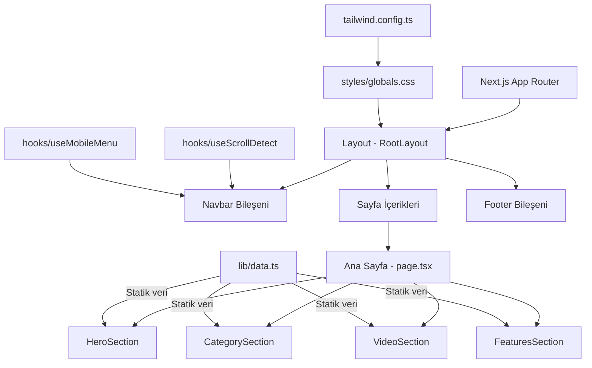
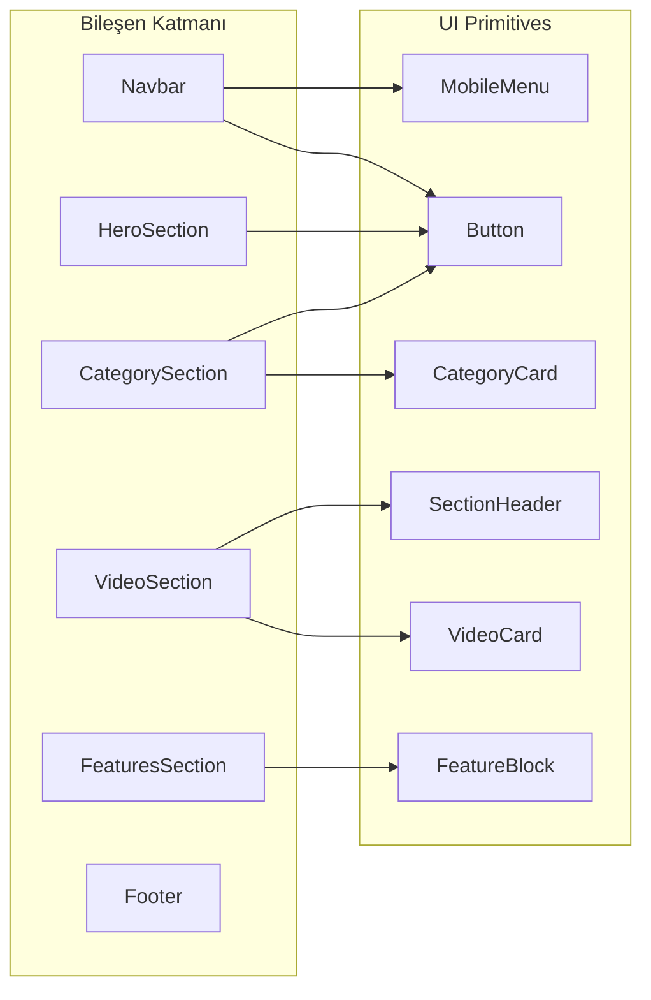
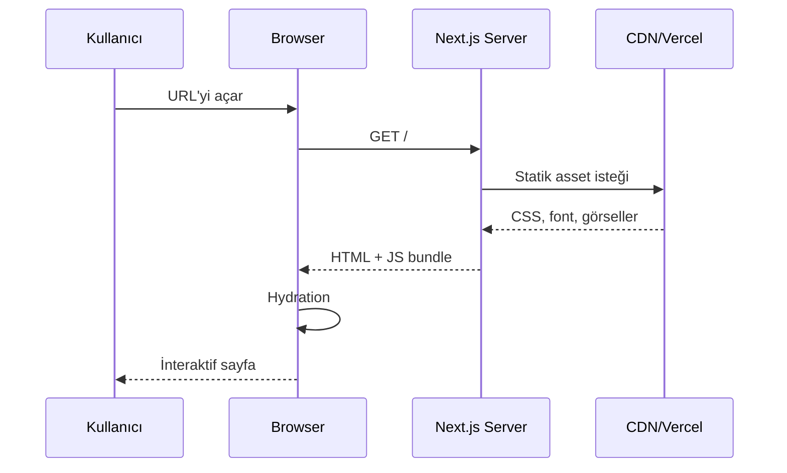
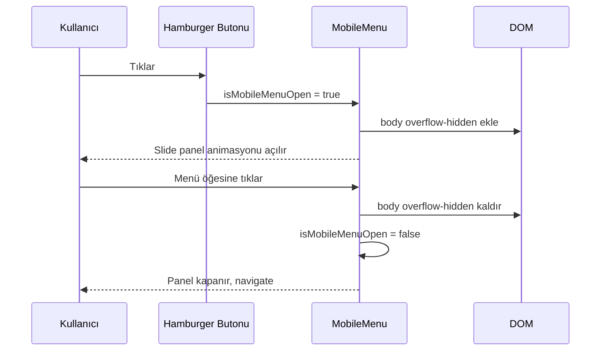
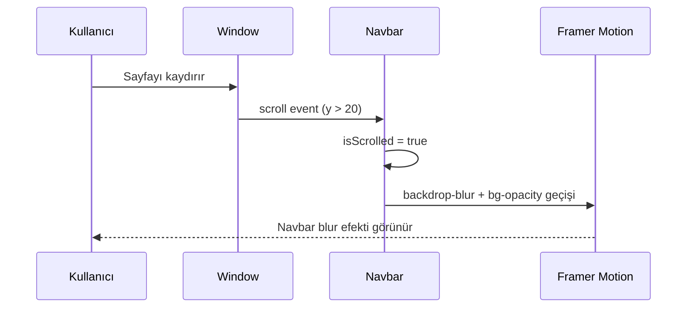

# Design Document: MSG Knight Online Eğitim Websitesi

## Overview

MSG Knight Online, Knight Online oyun topluluğuna yönelik ultra premium dark fantasy temalı bir eğitim video websitesidir. Site, Asas ve Okçu karakterlere özel eğitim videoları sunar; sinematik bir hero bölümü, kategori kartları, video listeleme ve kapsamlı bir footer ile tam responsive tasarım içerir. Next.js (App Router), TypeScript, Tailwind CSS ve Framer Motion kullanılarak geliştirilecektir.

Projenin temel hedefi, referans tasarıma birebir sadık kalarak 90+ Lighthouse skoru, üst düzey responsive davranış ve premium gaming estetiği sunmaktır.

## Architecture





## Components and Interfaces

### Bileşen 1: Navbar

**Amaç**: Sticky, blur-on-scroll üst navigasyon çubuğu. Desktop'ta logo + menü + CTA, mobilde hamburger menü sunar.

**Arayüz**:
```typescript
interface NavbarProps {
  // Props gerekmez; scroll durumu ve mobil menü hook'lardan yönetilir
}

interface NavItem {
  label: string
  href: string
}

interface NavbarState {
  isScrolled: boolean
  isMobileMenuOpen: boolean
}
```

**Sorumluluklar**:
- Scroll pozisyonunu dinleyerek `backdrop-blur` ve `bg-opacity` geçişini uygular
- Mobilde `body` scroll kilidini açar/kapar
- `useScrollDetect` ve `useMobileMenu` hook'larını kullanır
- Aktif menü öğesini `usePathname()` ile vurgular

---

### Bileşen 2: HeroSection

**Amaç**: Tam genişlik sinematik hero, dark overlay + gradient, sol hizalı içerik ve iki CTA butonu.

**Arayüz**:
```typescript
interface HeroSectionProps {
  // Statik içerik; props gerekmez
}

interface HeroContent {
  label: string        // "KNIGHT ONLINE"
  heading: string      // "EĞİTİM VİDEOLARI"
  description: string
  ctaButtons: HeroCTA[]
}

interface HeroCTA {
  label: string
  href: string
  icon: string         // emoji veya icon identifier
  variant: 'primary' | 'secondary'
}
```

**Sorumluluklar**:
- `next/image` ile optimize edilmiş arkaplan görseli
- `viewport height` bazlı responsive yükseklik (`min-h-[90vh]` gibi)
- Framer Motion ile içerik giriş animasyonu (fade-in + slide-up)
- Desktop: split layout; Mobil: stack layout

---

### Bileşen 3: CategorySection

**Amaç**: 2 kategori kartı (Asas ve Okçu), section başlığı ve "Tüm Videoları Gör" butonu.

**Arayüz**:
```typescript
interface CategorySectionProps {
  // Statik içerik
}

interface CategoryCard {
  id: string
  title: string
  description: string
  icon: React.ReactNode
  href: string
}
```

**Sorumluluklar**:
- Desktop: 2 kolon grid; Mobil: tek kolon stack
- Hover'da scale ve border glow animasyonu
- Ok işareti (arrow) yönlendirme ile kart tıklaması

---

### Bileşen 4: VideoSection

**Amaç**: Son 4 videoyu grid layout'ta listeler; her kart thumbnail, başlık, badge, süre, görüntülenme ve tarih içerir.

**Arayüz**:
```typescript
interface VideoSectionProps {
  videos: Video[]
}

interface Video {
  id: string
  title: string
  thumbnail: string
  category: 'asas' | 'okcu'
  categoryLabel: string
  duration: string          // "12:34"
  views: number
  date: string              // ISO date string
  author: {
    name: string
    avatarUrl: string
  }
  youtubeUrl: string
}
```

**Sorumluluklar**:
- Desktop: 4 kolon; Tablet: 2 kolon; Mobil: 1 kolon
- `next/image` ile optimize thumbnail
- Hover'da görsel zoom ve shadow büyümesi (Framer Motion)
- Kategori badge rengi (Asas: mavi, Okçu: turuncu/amber tonu)
- Süreli overlay (sağ alt köşe)

---

### Bileşen 5: FeaturesSection

**Amaç**: 4 özellik bloğu yatay sıra halinde, ikon + başlık + açıklama.

**Arayüz**:
```typescript
interface FeaturesSectionProps {
  features: Feature[]
}

interface Feature {
  id: string
  icon: string        // emoji veya icon identifier
  title: string
  description: string
}
```

**Sorumluluklar**:
- Desktop: 4 kolon; Tablet: 2×2; Mobil: 1 kolon
- Eşit spacing ve border ayırıcılar
- Hafif fade-in animasyonu (Framer Motion InView)

---

### Bileşen 6: Footer

**Amaç**: 4 kolonlu kapsamlı footer; logo, hızlı erişim, kategoriler ve iletişim bilgileri.

**Arayüz**:
```typescript
interface FooterProps {
  // Statik içerik
}

interface FooterColumn {
  heading: string
  links: FooterLink[]
}

interface FooterLink {
  label: string
  href: string
}

interface SocialLink {
  platform: 'youtube' | 'instagram' | 'discord' | 'x'
  url: string
  icon: React.ReactNode
}
```

**Sorumluluklar**:
- Desktop: 4 kolon; Mobil: stack layout
- Sosyal medya ikonları (YouTube, Instagram, Discord, X)
- "YOUTUBE KANALIMIZ" CTA butonu
- Copyright satırı alt divider ile

---

### Bileşen 7: Button (UI Primitive)

**Arayüz**:
```typescript
interface ButtonProps {
  children: React.ReactNode
  variant: 'primary' | 'secondary' | 'ghost' | 'dark'
  size: 'sm' | 'md' | 'lg'
  href?: string
  onClick?: () => void
  icon?: React.ReactNode
  className?: string
}
```

---

### Bileşen 8: VideoCard (UI Primitive)

**Arayüz**:
```typescript
interface VideoCardProps {
  video: Video
}
```

---

### Bileşen 9: SectionHeader (UI Primitive)

**Arayüz**:
```typescript
interface SectionHeaderProps {
  title: string
  actionLabel?: string
  actionHref?: string
  actionIcon?: React.ReactNode
}
```

---

## Data Models

### Model 1: Video

```typescript
interface Video {
  id: string
  title: string
  thumbnail: string
  category: 'asas' | 'okcu'
  categoryLabel: string
  duration: string
  views: number
  date: string
  author: {
    name: string
    avatarUrl: string
  }
  youtubeUrl: string
}
```

**Doğrulama Kuralları**:
- `id` boş olamaz
- `category` yalnızca `'asas'` veya `'okcu'` olabilir
- `duration` `MM:SS` formatında olmalı
- `views` sıfır veya pozitif tam sayı olmalı
- `youtubeUrl` geçerli bir URL formatında olmalı

---

### Model 2: NavItem

```typescript
interface NavItem {
  label: string
  href: string
}
```

**Doğrulama Kuralları**:
- `label` boş olamaz
- `href` `/` ile başlamalı (dahili link) veya `https://` ile (harici)

---

### Model 3: Feature

```typescript
interface Feature {
  id: string
  icon: string
  title: string
  description: string
}
```

---

### Model 4: CategoryCard

```typescript
interface CategoryCard {
  id: string
  title: string
  description: string
  icon: React.ReactNode
  href: string
}
```

---

## Sıralı Akış Diyagramları

### Kullanıcı Sayfa Yüklenme Akışı



### Mobil Menü Akışı



### Scroll Animasyon Akışı



---

## Error Handling

### Hata Senaryosu 1: Görsel Yüklenememe

**Koşul**: `next/image` kaynağı erişilemez olduğunda  
**Yanıt**: `placeholder="blur"` ve `blurDataURL` ile fallback görsel gösterilir  
**Kurtarma**: Fallback dark gradient arkaplan korunur

### Hata Senaryosu 2: Harici Link (YouTube) Açılamama

**Koşul**: YouTube CTA butonuna tıklandığında tarayıcı yeni sekme açamazsa  
**Yanıt**: `target="_blank" rel="noopener noreferrer"` ile güvenli yönlendirme yapılır  
**Kurtarma**: Kullanıcı aynı sekmede yönlendirilir

### Hata Senaryosu 3: Font Yüklenememe

**Koşul**: Inter font CDN'den yüklenemediğinde  
**Yanıt**: Poppins fallback devreye girer  
**Kurtarma**: System-ui ve sans-serif son fallback olarak tanımlıdır

---

## Testing Strategy

### Birim Test Yaklaşımı

Her UI bileşeni izole olarak test edilecek:
- Bileşen render doğruluğu (snapshot testler)
- Props doğrulama
- Conditional render (kategori badge rengi, mobil/desktop layout farkları)
- Erişilebilirlik (aria-label varlığı)

### Özellik Tabanlı Test Yaklaşımı

**Özellik Test Kütüphanesi**: `fast-check`

Özellik testleri şu alanlarda uygulanacak:
- Video veri filtreleme ve sıralama mantığı
- URL/href format doğrulaması
- Kategori badge renk atama fonksiyonu

### Entegrasyon Test Yaklaşımı

- Navbar scroll davranışı (scroll event simülasyonu)
- Mobil menü açma/kapama döngüsü
- Sayfa gezinmesi (Next.js router mock ile)

---

## Performans Değerlendirmeleri

- **LCP Hedefi**: Hero görseli `priority={true}` ile yüklenir
- **CLS Önlemi**: Tüm görsellere `width`/`height` veya `fill` + `aspect-ratio` atanır
- **Code Splitting**: Her section lazy import ile bölünür (above-the-fold dışındakiler)
- **Font Optimizasyonu**: `next/font/google` ile Inter preload edilir
- **Bundle Boyutu**: Framer Motion yalnızca animasyon gereken bileşenlerde import edilir
- **Image Formatı**: WebP/AVIF, `next/image` otomatik dönüşümü

---

## Güvenlik Değerlendirmeleri

- Tüm harici linkler `rel="noopener noreferrer"` ile güvence altına alınır
- Kullanıcı girişi (arama ikonu, iletişim formu) XSS'e karşı sanitize edilir
- CSP header'ları Vercel `next.config.js` üzerinden yapılandırılır
- Environment variable'lar `.env.local` içinde tutulur, repoya commit edilmez

---

## Bağımlılıklar

| Paket | Versiyon | Amaç |
|-------|----------|-------|
| `next` | `^15.x` | App Router, görsel optimizasyon, SSG |
| `react` | `^19.x` | UI bileşen sistemi |
| `typescript` | `^5.x` | Tip güvenliği |
| `tailwindcss` | `^3.x` | Utility-first CSS |
| `framer-motion` | `^11.x` | Animasyonlar |
| `lucide-react` | `^0.x` | İkon sistemi |
| `fast-check` | `^3.x` | Özellik tabanlı testler |
| `@testing-library/react` | `^16.x` | Bileşen testleri |
| `vitest` | `^2.x` | Test runner |

---

## Dosya Yapısı

```
app/
  layout.tsx          # RootLayout — font, metadata, Navbar, Footer
  page.tsx            # Ana Sayfa — tüm section'ları birleştirir
  globals.css         # Tailwind directives + custom CSS variables

components/
  layout/
    Navbar.tsx
    Footer.tsx
    MobileMenu.tsx
  sections/
    HeroSection.tsx
    CategorySection.tsx
    VideoSection.tsx
    FeaturesSection.tsx
  ui/
    Button.tsx
    VideoCard.tsx
    CategoryCard.tsx
    FeatureBlock.tsx
    SectionHeader.tsx

hooks/
  useScrollDetect.ts
  useMobileMenu.ts

lib/
  data.ts             # Statik video, feature, nav, footer verileri
  types.ts            # Tüm interface'ler ve type'lar
  utils.ts            # formatViews, formatDate, vb. yardımcı fonksiyonlar

public/
  images/
    hero-bg.jpg
    logo.svg
    thumbnails/
      video-1.jpg
      video-2.jpg
      video-3.jpg
      video-4.jpg
```

---

## Correctness Properties

*Bir özellik (property), sistemin tüm geçerli çalıştırmalarında doğru olması gereken davranış veya karakteristiktir — yani insan tarafından okunabilir spesifikasyonlar ile makine tarafından doğrulanabilir doğruluk garantileri arasındaki köprüdür.*

### Property 1: Kategori Badge Renk Ataması

*Her* geçerli `Video` nesnesi için, `category` alanı `'asas'` ise badge'e mavi ton CSS sınıfı, `'okcu'` ise turuncu/amber ton CSS sınıfı atanmalı; başka hiçbir kategori değeri kabul edilmemelidir.

**Validates: Requirements 6.5, 6.6**

---

### Property 2: Link Href Format Geçerliliği

*Her* `NavItem` ve `FooterLink` nesnesi için, `href` alanı ya `/` ile başlayan dahili bir yol ya da `https://` ile başlayan geçerli bir harici URL olmalıdır; bu iki formattan hiçbirine uymayan bir href geçersiz sayılmalıdır.

**Validates: Requirements 3.4, 8.2, 8.3**

---

### Property 3: formatViews Round-Trip Tutarlılığı

*Her* sıfır veya pozitif tam sayı views değeri için, `formatViews` fonksiyonu boş olmayan bir string döndürmeli ve 1000'in altındaki değerler için döndürülen string sayının kendisiyle birebir eşleşmelidir.

**Validates: Requirements 6.11, 11.1, 11.2**

---

### Property 4: formatDate Geçersiz Giriş Toleransı

*Her* geçersiz veya tanımsız tarih string'i için, `formatDate` fonksiyonu boş string (`""`) veya `"—"` döndürmeli; hiçbir zaman hata fırlatmamalıdır.

**Validates: Requirements 11.3, 11.4**

---

### Property 5: Scroll Detect Hook Doğruluğu

*Her* scroll pozisyonu değeri için, `useScrollDetect` hook'u 20 piksel ve üzerinde `isScrolled = true`, 20 pikselin altında `isScrolled = false` döndürmelidir; bu sınır tüm pozitif tam sayı scroll değerleri için tutarlı olmalıdır.

**Validates: Requirements 3.2**

---

### Property 6: Mobil Menü Body Lock Round-Trip

*Her* mobil menü açma/kapama döngüsü için, menü açıldığında `document.body` üzerinde `overflow: hidden` uygulanmalı; menü kapandığında bu kısıtlama kaldırılmalı ve body başlangıç durumuna dönmelidir.

**Validates: Requirements 3.8**
